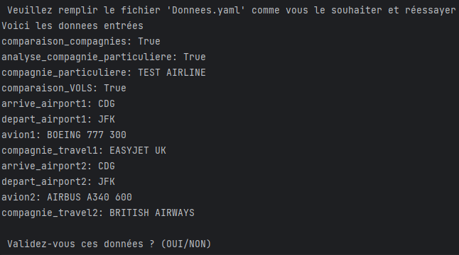
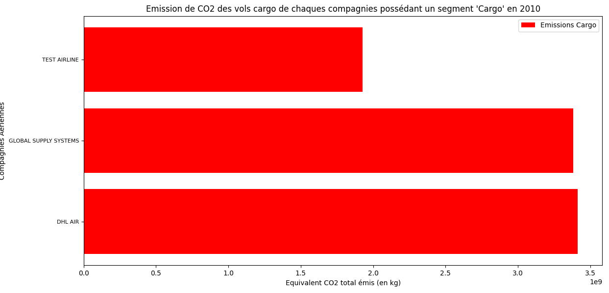

# Exemple d'éxécution de l'application:
## Sélection de données dans le fichier 'Donnees.yaml'

## Éxécution du fichier 'Main.py'
Premièrement, lorsque que vous exécuter le script, vous obtenez le message suivant dans votre console:

Après avoir appuyé sur la touche 'ENTER' de votre clavier, on vous affiche les sélections que vous avez effectué dans le 
fichier 'Donnees.yaml' et on vous demande de valider celles-ci.

Si vous entrez NON, vous obtenez le message suivant.
On vous demande d'aller modifier vos sélections. On vous affiche de nouveau les sélections et vous redemande ensuite de valider vos sélections.

Si vous entrez OUI, le programme poursuit son éxécution. 

### Comparaison des compagnies aériennes:
1. Le programme affiche le message 'Voici un diagramme barre de comparaison des émissions de CO2/passager des différentes compagnies aériennes britanniques' et le graphique suivant:

Fermez la fenêtre du grahique en appuyant sur le bouton X dans le coin en haut à droite.

2. Le programme affiche le message 'Voici un diagramme barre de comparaison des émissions totales des différentes compagnies aériennes britanniques' et le graphique suivant:

Fermez la fenêtre du grahique en appuyant sur le bouton X dans le coin en haut à droite.

3. Le programme affiche le message 'Voici un diagramme barre de comparaison des émissions liées au transport de marchandises des différentes compagnies aériennes britanniques' et le graphique suivant:

Fermez la fenêtre du grahique en appuyant sur le bouton X dans le coin en haut à droite.

### Analyse des compagnies aériennes:
1. Le programme affiche le message suivant:

Le pie chart suivant est affiché:

Fermez la fenêtre du grahique en appuyant sur le bouton X dans le coin en haut à droite.

2. Le programme affiche le message 'Voici un diagramme montrant la part d'utilisation des modèles d'avions de la flotte' et affiche le graphe ci-dessous:

Fermez la fenêtre du grahique en appuyant sur le bouton X dans le coin en haut à droite.

### Menu de comparaison de vols
Le programme affiche les données suivantes:

Ceci marque la fin de l'éxécution du programme.